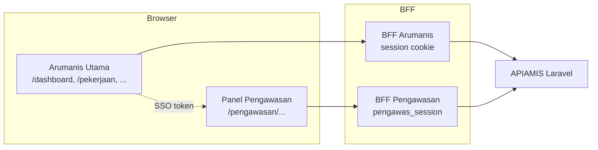
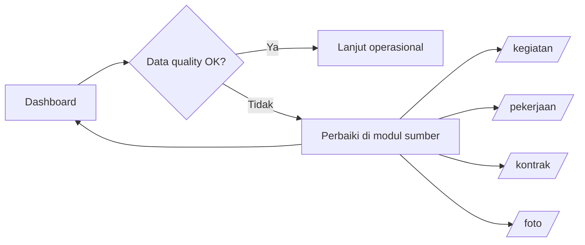
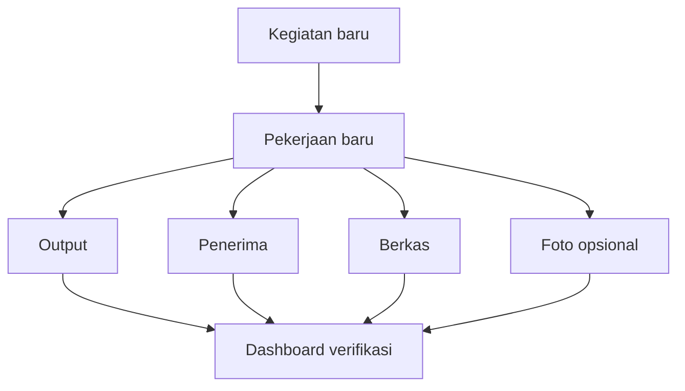
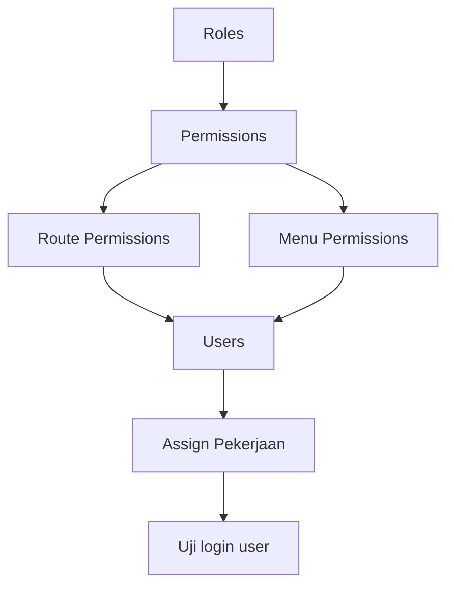
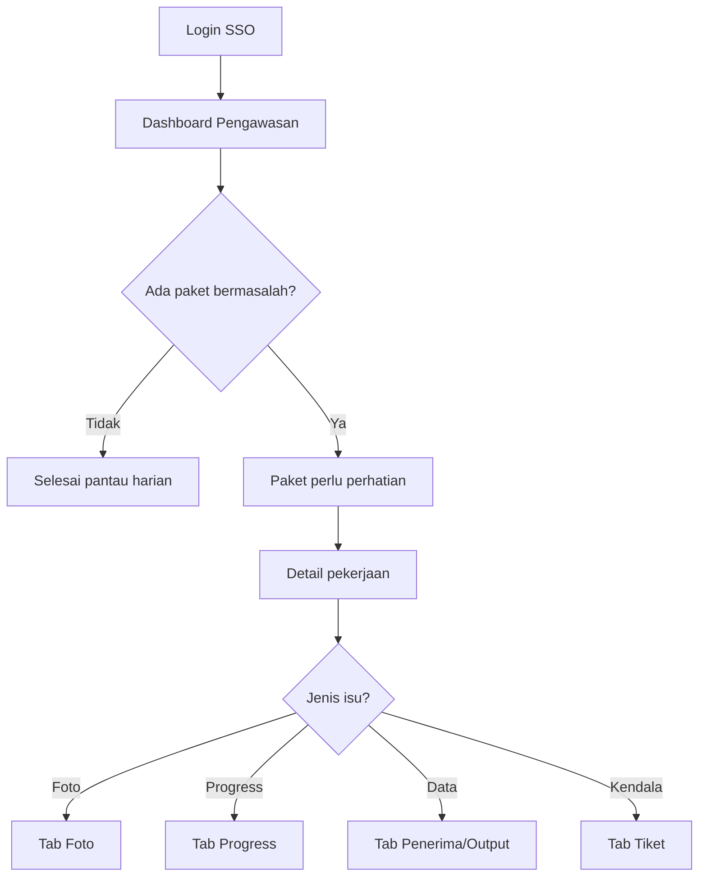
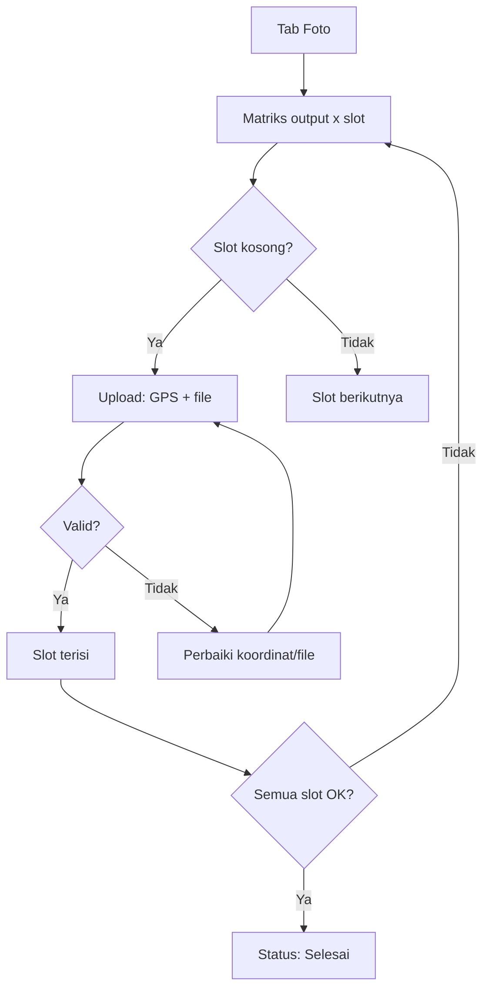
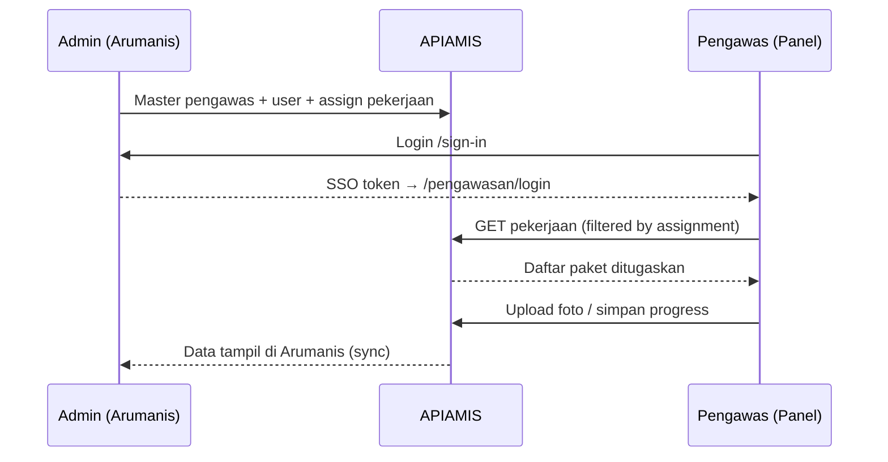
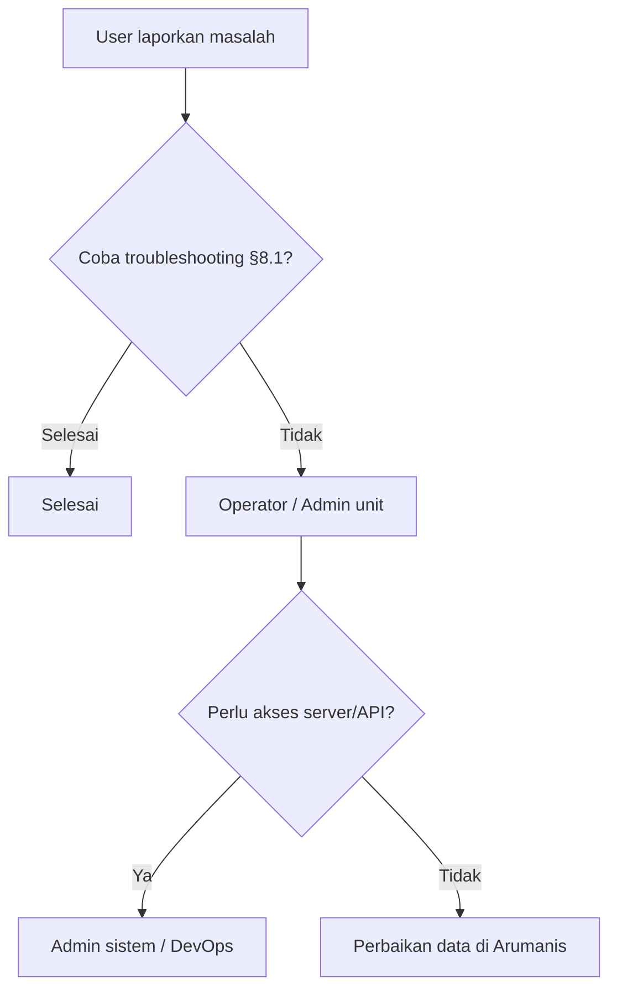

# SOP Penggunaan Arumanis & Panel Pengawasan

**Standar Operasional Prosedur (SOP)** penggunaan platform **Arumanis** (aplikasi utama) dan **Panel Pengawasan** (aplikasi lapangan).

| Item | Nilai |
|------|-------|
| **Versi dokumen** | 1.0 |
| **Tanggal** | 1 Juli 2026 |
| **Platform** | Arumanis v0.5.0 |
| **Repo** | [arumanis](https://github.com/ilhamtaufiq/arumanis) · [pengawas](https://github.com/ilhamtaufiq/arumanis-pengawasan) |
| **Backend** | [apiamis](https://github.com/ilhamtaufiq/apiamis) |

---

## Daftar Isi

1. [Ruang Lingkup](#1-ruang-lingkup)
2. [Definisi & Peran](#2-definisi--peran)
3. [Peta Aplikasi](#3-peta-aplikasi)
4. [SOP Akses & Autentikasi](#4-sop-akses--autentikasi)
5. [SOP Arumanis Utama (Kantor/Admin)](#5-sop-arumanis-utama-kantoradmin)
6. [SOP Panel Pengawasan (Lapangan)](#6-sop-panel-pengawasan-lapangan)
7. [SOP Integrasi Admin ↔ Pengawas](#7-sop-integrasi-admin--pengawas)
8. [SOP Eskalasi & Troubleshooting](#8-sop-eskalasi--troubleshooting)
9. [Checklist Operasional](#9-checklist-operasional)

---

## 1. Ruang Lingkup

Dokumen ini mengatur cara penggunaan dua aplikasi web yang saling terhubung:

| Aplikasi | Repo lokal | URL produksi (contoh) | Pengguna utama |
|----------|------------|------------------------|----------------|
| **Arumanis Utama** | `www/bun` | `https://arumanis.cianjurkab.go.id` | Admin, operator, viewer |
| **Panel Pengawasan** | `www/pengawas` | `https://arumanis.cianjurkab.go.id/pengawasan` | Pengawas, konsultan pengawas |

Keduanya memakai akun yang sama di backend **APIAMIS**. Panel Pengawasan masuk melalui **SSO** dari Arumanis utama — tidak ada pendaftaran akun terpisah.

---

## 2. Definisi & Peran

### 2.1 Matriks Peran

| Peran | Aplikasi | Hak utama | Keterbatasan |
|-------|----------|-----------|--------------|
| **Admin** | Arumanis | Semua modul, manajemen user, impersonate | — |
| **Operator** | Arumanis | Input & edit data sesuai menu permission | Tidak bisa ubah role/permission |
| **Viewer** | Arumanis | Lihat data saja | Tidak bisa create/update/delete |
| **Pengawas** | Panel Pengawasan | Pantau paket ditugaskan, foto, progress, tiket | Hanya pekerjaan yang di-assign |
| **Konsultan Pengawas** | Panel Pengawasan | Sama seperti pengawas | Sama seperti pengawas |

### 2.2 Routing otomatis setelah login

| Kondisi role | Tujuan setelah login |
|--------------|----------------------|
| Admin / Operator / Viewer | Dashboard Arumanis (`/dashboard`) |
| Pengawas / Konsultan Pengawas (tanpa admin/manager) | SSO otomatis ke Panel Pengawasan (`/pengawasan/`) |
| Admin yang impersonate pengawas | Panel Pengawasan dengan banner kuning |

---

## 3. Peta Aplikasi

### 3.1 Arsitektur integrasi



### 3.2 Flow login & routing peran

```mermaid
flowchart TD
    Start([Buka URL Arumanis]) --> SignIn[/sign-in]
    SignIn --> Auth{Login berhasil?}
    Auth -->|Tidak| Err[Tampilkan error<br/>perbaiki kredensial]
    Err --> SignIn
    Auth -->|Ya| Role{Peran user?}
    Role -->|Admin / Operator / Viewer| Dash[Dashboard Arumanis]
    Role -->|Pengawas / Konsultan| SSO[Redirect SSO<br/>/pengawasan/login?token=...]
    SSO --> Sync[Sinkron token → cookie sesi]
    Sync --> PDash[Dashboard Pengawasan]
```

### 3.3 Menu utama Arumanis

| Grup menu | Modul | URL | SOP terkait |
|-----------|-------|-----|-------------|
| Dashboard | Ringkasan | `/dashboard` | [5.1](#51-sop-dashboard--monitoring) |
| Dashboard | Rekap Progress | `/progress_rekap` | [5.6](#56-sop-review-progress) |
| Dashboard | Tiket | `/tiket` | [5.8](#58-sop-tiket--notifikasi) |
| Master Data | Kegiatan | `/kegiatan` | [5.2](#52-sop-input-program-baru) |
| Master Data | Pekerjaan | `/pekerjaan` | [5.2](#52-sop-input-program-baru) |
| Master Data | Kontrak | `/kontrak` | [5.3](#53-sop-kontrak--penyedia) |
| Master Data | Output / Penerima | `/output`, `/penerima` | [5.2](#52-sop-input-program-baru) |
| Master Data | Pengawas | `/pengawas` | [7.1](#71-sop-penugasan-pengawas) |
| Master Data | Assign Pekerjaan | `/user-pekerjaan` | [7.1](#71-sop-penugasan-pengawas) |
| Dokumentasi | Berkas / Foto | `/berkas`, `/foto` | [5.4](#54-sop-dokumentasi-berkas--foto) |
| Dokumentasi | Peta Progress | `/map` | [5.6](#56-sop-review-progress) |
| Akses | Users / Roles | `/users`, `/roles` | [5.7](#57-sop-manajemen-akses) |
| Pengaturan | Settings | `/settings` | [5.9](#59-sop-pengaturan-aplikasi) |

### 3.4 Menu Panel Pengawasan

| Menu | URL | SOP terkait |
|------|-----|-------------|
| Dashboard | `/pengawasan/` | [6.1](#61-sop-pemantauan-harian) |
| Pekerjaan | `/pengawasan/pekerjaan` | [6.2](#62-sop-detail-pekerjaan) |
| Buat Laporan | `/pengawasan/buat-laporan` | [6.4](#64-sop-input-progress--laporan) |
| Tiket | `/pengawasan/tiket` | [6.5](#65-sop-tiket-lapangan) |
| Notifikasi | `/pengawasan/notifikasi` | [6.6](#66-sop-notifikasi) |
| Panduan | `/pengawasan/panduan` | Referensi in-app |
| Profil | `/pengawasan/profile` | [6.7](#67-sop-profil--validasi-data) |

---

## 4. SOP Akses & Autentikasi

### 4.1 Login Arumanis Utama

| No | Langkah | Input / Aksi | Output yang diharapkan | PIC |
|----|---------|--------------|------------------------|-----|
| 1 | Buka browser (Chrome/Firefox/Edge terbaru) | URL aplikasi dari admin | Halaman `/sign-in` tampil | Semua user |
| 2 | Isi email | Akun terdaftar APIAMIS | Field valid | Semua user |
| 3 | Isi password | Min. 7 karakter | Field valid | Semua user |
| 4 | Klik **Sign In** (atau **Google Login**) | — | Toast selamat datang | Semua user |
| 5 | Verifikasi halaman tujuan | — | Dashboard sesuai peran (lihat §2.2) | Semua user |

### 4.2 Logout

| No | Langkah | Aplikasi | Output |
|----|---------|----------|--------|
| 1 | Klik avatar/nama di header | Arumanis | Dropdown menu |
| 2 | Pilih **Logout** | Arumanis / Pengawasan | Redirect ke `/sign-in` |
| 3 | Tutup tab jika perangkat publik | — | Sesi tidak tersisa |

### 4.3 Sesi habis (401)

| Gejala | Tindakan | Aplikasi |
|--------|----------|----------|
| "Sesi tidak valid" | Klik **Masuk ulang** | Pengawasan |
| Redirect ke login | Login ulang di `/sign-in` | Arumanis |
| Data tidak termuat | Refresh setelah login ulang | Keduanya |

---

## 5. SOP Arumanis Utama (Kantor/Admin)

### 5.1 SOP Dashboard & Monitoring

| No | Prosedur | Langkah | Frekuensi | Output |
|----|----------|---------|-----------|--------|
| 1 | Buka ringkasan | Login → `/dashboard` | Harian | KPI & widget tampil |
| 2 | Filter tahun anggaran | Pilih TA di header | Per sesi | Data sesuai tahun |
| 3 | Cek kualitas data | Lihat Data Quality Stats | Mingguan | Daftar item perlu perbaikan |
| 4 | Drill-down | Klik widget → modul terkait | Sesuai kebutuhan | Detail data |



### 5.2 SOP Input Program Baru

**Tujuan:** Mencatat kegiatan, pekerjaan, output, dan dokumentasi awal.

| No | Modul | Langkah | Field wajib | Verifikasi |
|----|-------|---------|-------------|------------|
| 1 | Kegiatan `/kegiatan` | Tambah → isi form → Simpan | Nama, kode, sumber dana, pagu, TA | Muncul di daftar kegiatan |
| 2 | Pekerjaan `/pekerjaan` | Tambah → pilih kegiatan, kecamatan, desa | Nama paket, lokasi, pagu | Terhubung ke kegiatan |
| 3 | Output `/output` | Tambah per pekerjaan | Komponen, satuan, volume | Muncul di detail pekerjaan |
| 4 | Penerima `/penerima` | Tambah penerima manfaat | Nama, tipe individu/komunal | Count penerima bertambah |
| 5 | Berkas `/berkas` | Upload dokumen | Pekerjaan, tipe, file | File dapat diunduh |
| 6 | Foto `/foto` | Upload foto awal (opsional) | Pekerjaan, gambar, koordinat | Thumbnail tampil |
| 7 | Dashboard | Refresh ringkasan | — | Metrik pekerjaan terupdate |



### 5.3 SOP Kontrak & Penyedia

| No | Prosedur | Langkah | Prasyarat | Output |
|----|----------|---------|-----------|--------|
| 1 | Daftar penyedia | `/penyedia` → Tambah | — | Master vendor siap |
| 2 | Buat kontrak | `/kontrak` → pilih pekerjaan & penyedia | Pekerjaan & penyedia ada | Kontrak aktif |
| 3 | Addendum (jika ada) | `/kontrak-addendums` → Tambah | Kontrak induk ada | Nilai/tanggal terupdate |
| 4 | Register dokumen | `/pekerjaan/register` → kelola nomor | Pekerjaan ada | Register tersinkron |

### 5.4 SOP Dokumentasi Berkas & Foto

| No | Jenis | Langkah | Aturan | Verifikasi |
|----|-------|---------|--------|------------|
| 1 | Berkas kontrak/RAB | `/berkas` → Upload | Pilih tipe dokumen benar | Preview/unduh OK |
| 2 | Foto lapangan (kantor) | `/foto` → Upload | Koordinat dalam batas desa pekerjaan | Validasi geo-fencing hijau |
| 3 | Drive 3-zona | Menu Drive pekerjaan | Zona: Puspen / Pekerjaan / Users | File di folder benar |
| 4 | Sort & tampilan | Toggle grid/list, sort naik/turun | — | Urutan sesuai pilihan |

### 5.5 SOP Penugasan ke Panel Pengawasan

Lihat [§7.1](#71-sop-penugasan-pengawas) — admin wajib menyelesaikan penugasan sebelum pengawas bisa bekerja di lapangan.

### 5.6 SOP Review Progress

| No | Langkah | Modul | Output |
|----|---------|-------|--------|
| 1 | Buka rekap | `/progress_rekap` atau widget dashboard | Grafik & tabel progress |
| 2 | Filter tahun | Fiscal year selector | Data TA benar |
| 3 | Identifikasi deviasi | Kolom selisih rencana–realisasi | Daftar paket deviasi |
| 4 | Sinkronisasi Puspen | Modul PUSPEN review | Progress estimasi tersinkron |
| 5 | Tindak lanjut | Koordinasi ke pengawas via notifikasi/tiket | Progress terisi mingguan |

### 5.7 SOP Manajemen Akses

| No | Prosedur | URL | Urutan |
|----|----------|-----|--------|
| 1 | Buat/pastikan role | `/roles` | Admin only |
| 2 | Atur permission | `/permissions` | Setelah role ada |
| 3 | Atur route & menu | `/route-permissions`, `/menu-permissions` | Sesuai kebutuhan modul |
| 4 | Buat user | `/users` → Tambah (nama, email, password, role) | Assign ≥1 role |
| 5 | Batasi kegiatan (opsional) | `/kegiatan-role` | Jika perlu isolasi TA |
| 6 | Assign pekerjaan pengawas | `/user-pekerjaan` | Wajib untuk role pengawas |
| 7 | Uji login | Login sebagai user baru | Menu sesuai permission |



### 5.8 SOP Tiket & Notifikasi

| No | Aksi | Lokasi | Keterangan |
|----|------|--------|------------|
| 1 | Lihat tiket masuk | `/tiket` | Filter status/kategori |
| 2 | Tanggapi / ubah status | Detail tiket | Koordinasi dengan pengawas |
| 3 | Broadcast pengumuman | `/notifications/broadcast` | Admin only |
| 4 | Pantau notifikasi | `/notifications` | Semua user terautentikasi |

### 5.9 SOP Pengaturan Aplikasi

| No | Pengaturan | URL | PIC |
|----|------------|-----|-----|
| 1 | Brand & email SMTP | `/settings` | Admin |
| 2 | Template kontrak | `/settings/kontrak-templates` | Admin |
| 3 | Visibilitas halaman publik SPM | Settings → toggle publik | Admin |
| 4 | Audit trail | `/audit-logs` | Admin (read-only) |

---

## 6. SOP Panel Pengawasan (Lapangan)

### 6.1 SOP Pemantauan Harian

| No | Langkah | Layar | Indikator perhatian |
|----|---------|-------|---------------------|
| 1 | Login via SSO dari Arumanis | Dashboard `/pengawasan/` | — |
| 2 | Baca 4 KPI card | Dashboard | Belum isi progress, deviasi, foto kurang |
| 3 | Filter tahun / search | Toolbar dashboard | — |
| 4 | Buka "Paket perlu perhatian" | Section bawah dashboard | Maks. 8 paket prioritas |
| 5 | Klik paket → detail | `/pengawasan/pekerjaan/:id` | — |



### 6.2 SOP Detail Pekerjaan

| Tab | Fungsi | Input utama | Simpan |
|-----|--------|-------------|--------|
| **Ringkasan** | Info paket, kontrak, status foto | Read-only | — |
| **Output** | CRUD komponen (pipa, MCK, sumur, dll.) | Komponen, satuan, volume, komunal | Tombol Tambah/Simpan |
| **Penerima** | CRUD penerima manfaat | Nama, jiwa, NIK, alamat, komunal | Tambah / Edit / Hapus |
| **Foto** | Matriks output × slot 0–100% | File gambar + koordinat GPS | Unggah per slot |
| **Progress** | Estimasi mingguan | Rencana & realisasi per item | Simpan (jika ada perubahan) |
| **Tiket** | Tiket terkait paket | Lihat & komentar | Simpan komentar |

### 6.3 SOP Upload Foto Lapangan

| No | Langkah | Detail | Validasi |
|----|---------|--------|----------|
| 1 | Buka tab **Foto** | Detail pekerjaan | Matriks output × slot tampil |
| 2 | Klik slot **Kosong** | 0%, 25%, 50%, 75%, atau 100% | Modal upload terbuka |
| 3 | Ambil koordinat | Tombol GPS atau input manual | Koordinat terisi |
| 4 | Pilih file foto | Format gambar; EXIF diekstrak otomatis | Preview OK |
| 5 | Klik **Unggah foto** | — | Thumbnail di slot |
| 6 | Ulangi semua slot wajib | Per output individu/komunal | Status foto → Selesai |
| 7 | Cetak dokumentasi (opsional) | Tombol **Cetak Foto** → PDF | Izinkan popup browser |

**Status foto agregat:**

| Status | Kondisi |
|--------|---------|
| Belum ada foto | Tidak ada unggahan |
| Belum Selesai | Slot wajib belum terpenuhi |
| Selesai | Semua slot terpenuhi |



### 6.4 SOP Input Progress & Laporan

| No | Langkah | Tab / Menu | Catatan |
|----|---------|------------|---------|
| 1 | Buka detail pekerjaan | Tab **Progress** atau menu **Buat Laporan** | — |
| 2 | Pilih minggu aktif | Dropdown minggu | Default minggu berjalan |
| 3 | Isi **Rencana** per item | Kolom rencana | Volume target minggu ini |
| 4 | Isi **Realisasi** per item | Kolom realisasi | Volume aktual |
| 5 | Klik **Simpan** | Aktif jika ada perubahan | Badge "Tersimpan" 2 detik |
| 6 | Cek KPI | Deviasi & progress terhitung | Deviasi negatif = perlu tindak lanjut |

### 6.5 SOP Tiket Lapangan

| No | Prosedur | Langkah | Output |
|----|----------|---------|--------|
| 1 | Identifikasi kendala | Lapangan / koordinasi | Keputusan buat tiket |
| 2 | Buat tiket | `/pengawasan/tiket` atau shortcut **Lapor Tiket** | Tiket status Menunggu |
| 3 | Isi subjek & deskripsi | Kategori: Permasalahan Lapangan | Tiket tercatat |
| 4 | Pantau status | Daftar tiket kiri | Diproses / Selesai |
| 5 | Tambah komentar | Panel kanan → Simpan komentar | Thread terupdate |
| 6 | Eskalasi ke kantor | Admin tangani di Arumanis `/tiket` | Status ditutup |

### 6.6 SOP Notifikasi

| No | Langkah | Lokasi | Tindakan |
|----|---------|--------|----------|
| 1 | Lihat lonceng di header | Semua halaman pengawasan | Badge jumlah unread |
| 2 | Buka daftar lengkap | `/pengawasan/notifikasi` | Tandai dibaca |
| 3 | Klik notifikasi dengan action | URL ke pekerjaan/tiket | Langsung ke konteks |

### 6.7 SOP Profil & Validasi Data

| No | Cek | Lokasi | Jika bermasalah |
|----|-----|--------|-----------------|
| 1 | Nama & email benar | `/pengawasan/profile` | Hubungi admin ubah di `/users` |
| 2 | NIP cocok master pengawas | Section data pengawas | Admin perbaiki data `/pengawas` |
| 3 | Role & permission | Badge di profil | Admin sesuaikan role |

---

## 7. SOP Integrasi Admin ↔ Pengawas

### 7.1 SOP Penugasan Pengawas

| No | PIC | Langkah (Arumanis) | Verifikasi (Pengawasan) |
|----|-----|-------------------|-------------------------|
| 1 | Admin | `/pengawas` → pastikan master pengawas & NIP benar | — |
| 2 | Admin | `/users` → user punya role pengawas | Login SSO berhasil |
| 3 | Admin | `/user-pekerjaan` → assign pekerjaan ke user | Paket muncul di dashboard pengawas |
| 4 | Pengawas | Login → dashboard | KPI > 0 paket |
| 5 | Pengawas | Buka 1 paket → cek tab | Data output/penerima ada |



### 7.2 SOP Impersonate (Admin)

| No | Langkah | Output |
|----|---------|--------|
| 1 | `/users` → pilih user pengawas → **Impersonate** | Banner kuning di Arumanis |
| 2 | Sistem buka Panel Pengawasan | Sesi atas nama pengawas |
| 3 | Review alur lapangan | Validasi UX & data |
| 4 | **Stop Impersonate** | Kembali ke dashboard admin |

---

## 8. SOP Eskalasi & Troubleshooting

### 8.1 Matriks masalah umum

| No | Gejala | Aplikasi | Penyebab umum | Solusi |
|----|--------|----------|---------------|--------|
| 1 | Login gagal | Arumanis | Email/password salah | Reset via admin |
| 2 | Redirect loop `?token=` | Pengawasan | Build lama / token invalid | Clear cache; login ulang dari Arumanis |
| 3 | Daftar pekerjaan kosong | Pengawasan | Belum di-assign | Admin: `/user-pekerjaan` |
| 4 | 403 Akses ditolak | Keduanya | Role tidak cukup | Admin: route/menu permission |
| 5 | GPS gagal | Pengawasan | Izin lokasi ditolak | Input koordinat manual |
| 6 | Foto ditolak | Keduanya | Koordinat di luar desa | Ambil foto di lokasi pekerjaan |
| 7 | Progress tidak simpan | Pengawasan | Tidak ada perubahan field | Edit rencana/realisasi dulu |
| 8 | Popup cetak diblokir | Pengawasan | Browser block popup | Izinkan popup untuk domain |
| 9 | 502 / error API | Keduanya | Backend down | Hubungi admin infrastruktur |

### 8.2 Eskalasi



| Level | PIC | Kontak | Cakupan |
|-------|-----|--------|---------|
| L1 | User / Pengawas | — | Reset sesi, cek assign, izin browser |
| L2 | Operator / Admin unit | Tim AMS | Data master, penugasan, tiket |
| L3 | Admin sistem | Tim IT Pemerintah | Server, APIAMIS, deploy |

---

## 9. Checklist Operasional

### 9.1 Admin — Mingguan

| ✓ | Item |
|---|------|
| ☐ | Cek dashboard & data quality stats |
| ☐ | Review tiket terbuka & tindak lanjut |
| ☐ | Verifikasi penugasan pengawas (`/user-pekerjaan`) |
| ☐ | Pastikan kontrak & register dokumen pekerjaan aktif lengkap |
| ☐ | Broadcast notifikasi jika ada deadline laporan |

### 9.2 Pengawas — Harian / Mingguan

| ✓ | Item | Frekuensi |
|---|------|-----------|
| ☐ | Login & cek dashboard KPI | Harian |
| ☐ | Tindaklanjuti paket "perlu perhatian" | Harian |
| ☐ | Upload foto slot yang masih kosong | Per kunjungan lapangan |
| ☐ | Isi progress rencana & realisasi minggu aktif | Mingguan (sebelum Jumat) |
| ☐ | Buat tiket jika ada kendala teknis | Sesuai kejadian |
| ☐ | Cek notifikasi dari kantor | Harian |

### 9.3 Operator — Input Data

| ✓ | Item |
|---|------|
| ☐ | Kegiatan & pekerjaan baru tercatat lengkap |
| ☐ | Output & penerima sinkron dengan RAB |
| ☐ | Berkas kontrak terupload di Drive/Berkas |
| ☐ | Koordinat desa pekerjaan valid untuk geo-fencing |

---

## Lampiran

| Dokumen | Lokasi |
|---------|--------|
| Panduan modul Arumanis | [docs/user-guide/](user-guide/index.md) |
| Panel pengawasan (internal) | [docs/user-guide/pengawas-panel.md](user-guide/pengawas-panel.md) |
| Skenario penggunaan | [docs/user-guide/skenario-penggunaan.md](user-guide/skenario-penggunaan.md) |
| Panduan pengawas (repo) | `www/pengawas/USER_GUIDE.md` |
| Pusat bantuan publik | `/docs/index.html` |
| Changelog platform | [/changelog](https://arumanis.cianjurkab.go.id/changelog) |
| Lineage platform | [LINEAGE.md](../LINEAGE.md) |

---

*Dokumen ini merupakan SOP operasional. Perubahan fitur mengikuti [CHANGELOG.md](../CHANGELOG.md). Untuk pertanyaan teknis, buka issue di repositori GitHub.*