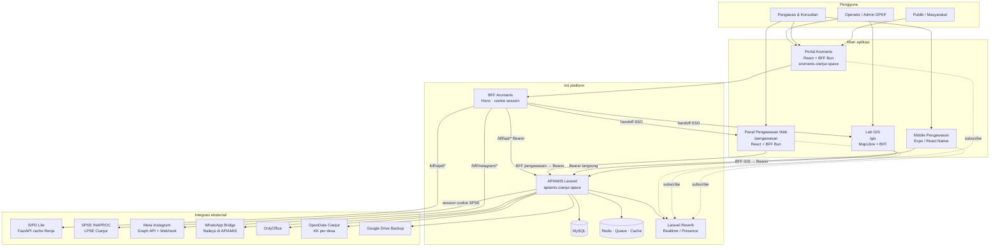
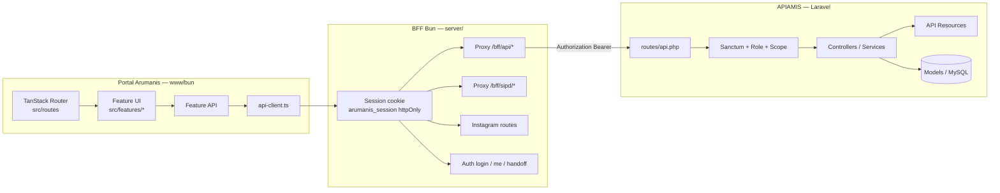
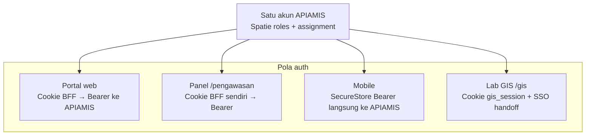
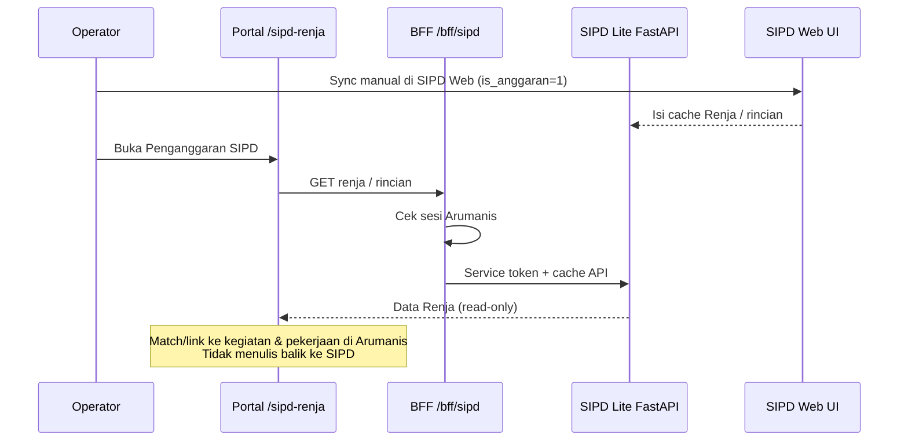
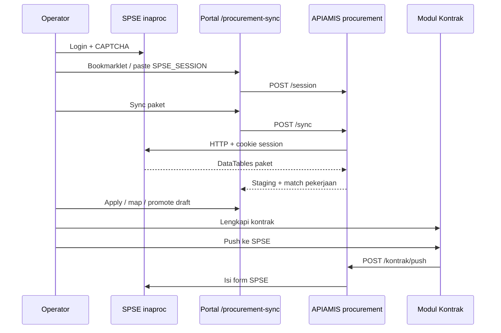
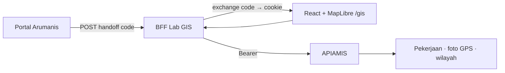
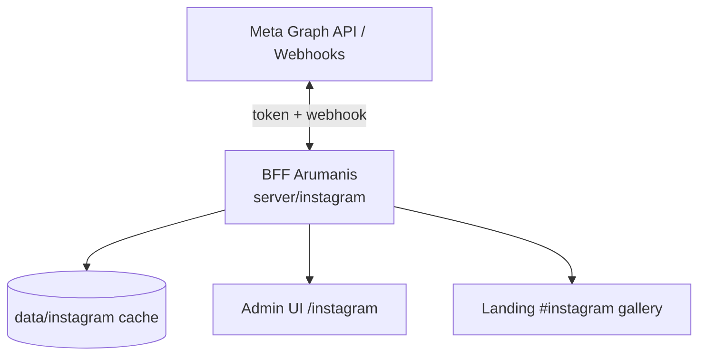
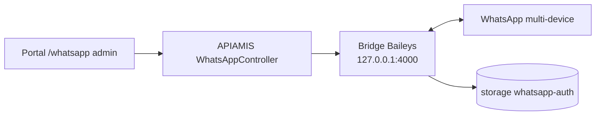
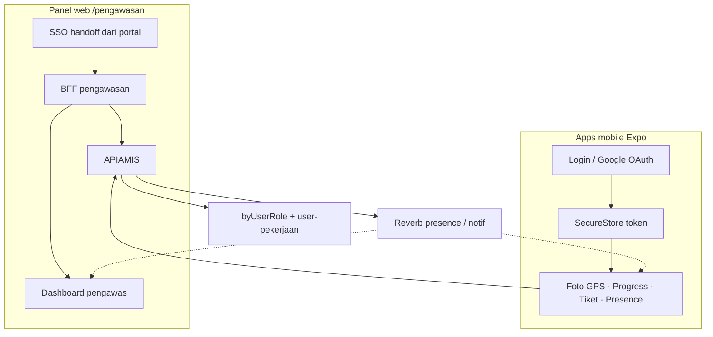
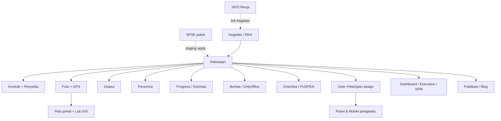

# Peta Sistem Arumanis

**Satu data air minum & sanitasi Kabupaten Cianjur** — peta arsitektur dari portal, API, panel lapangan, hingga integrasi eksternal.

> Sumber: kode aktual + [integrasi-platform.md](./integrasi-platform.md), runbook SPSE / WhatsApp / Instagram, repo `apiamis`, `pengawas`, `arumanis-gis`.

---

## 1. Peta ekosistem (tinggi)



---

## 2. Lapisan internal (portal + API)



**Domain sentral di API & portal:** `pekerjaan` → kontrak, berkas, foto, output, penerima, progress, checklist, PUSPEN, user-pekerjaan.

---

## 3. Matriks klien & autentikasi



| Klien | Path / host | Sesi | Ke APIAMIS |
|-------|-------------|------|------------|
| Portal Arumanis | `/` | `arumanis_session` (BFF) | Bearer via BFF |
| Panel pengawasan | `/pengawasan` | cookie BFF pengawasan | Bearer via BFF |
| Mobile pengawas | APK Expo | SecureStore | Bearer langsung |
| Lab GIS | `/gis` | `gis_session` path `/gis` | Bearer via BFF GIS |
| SIPD (baca) | proxy BFF | sesi Arumanis + `SIPD_SERVICE_TOKEN` | tidak (ke SIPD Python) |
| SPSE | server-side | cookie `SPSE_SESSION` di APIAMIS | via service procurement |

---

## 4. Integrasi per sistem

### 4.1 SIPD (Renja / penganggaran)



| Arah | Isi |
|------|-----|
| SIPD → Arumanis | Cache Renja, rincian belanja (baca) |
| Arumanis → SIPD | Tidak (sync sumber di UI SIPD) |

---

### 4.2 SPSE (LPSE / pengadaan)



| Arah | Isi |
|------|-----|
| SPSE → Arumanis | Paket, dokumen, match staging |
| Arumanis → SPSE | Push data kontrak (opsional) |

---

### 4.3 Lab GIS (`arumanis-gis`)



- Login **hanya SSO** dari portal (pola sama pengawasan).
- Fokus: peta, analisis spasial, batas admin, foto ber-GPS.

---

### 4.4 Instagram (Meta)



| Fitur | Jalur |
|-------|--------|
| Gallery publik | `GET /bff/instagram/gallery` (cache) |
| Inbox DM / balas | Admin + Human Agent tag |
| Komentar / events | Webhook → cache |

*Instagram di-handle di BFF portal, bukan di Laravel (kecuali ada proxy status terpisah).*

---

### 4.5 WhatsApp (Baileys)



- Production: bridge **bundled** di container APIAMIS.
- Dev: `bun run whatsapp:bridge` di repo portal.

---

### 4.6 Panel pengawasan web + mobile



| Fitur lapangan | Web panel | Mobile | Tampil di portal |
|----------------|:---------:|:------:|------------------|
| Daftar paket assign | ✓ | ✓ | user-pekerjaan |
| Foto + GPS | ✓ | ✓ | peta, dashboard |
| Progress estimasi | ✓ | ✓ | deviasi / PUSPEN |
| Tiket | ✓ | ✓ | modul tiket |
| Presence / lokasi | — | ✓ heartbeat | Lokasi pengawas |
| Offline queue upload | — | ✓ | setelah online |

---

## 5. Alur data bisnis (inti)



---

## 6. Deploy & path produksi (ringkas)

```text
https://arumanis.cianjur.space/
├── /                    → Portal Arumanis (SPA + BFF)
├── /pengawasan/*        → Panel pengawas (SPA terpisah, exclude SW)
├── /gis/*               → Lab GIS (SPA terpisah)
├── /bff/*               → BFF portal (api, sipd, instagram, auth)
└── (static / PWA)

https://apiamis.cianjur.space/api
├── REST + Sanctum
├── Reverb (realtime)
└── WhatsApp bridge internal :4000

https://sipd-lite.cianjur.space     → SIPD Lite + cache
https://spse.inaproc.id/cianjurkab  → SPSE LPSE
```

| Repo lokal | Peran |
|------------|--------|
| `C:\laragon\www\bun` | Portal Arumanis + BFF |
| `C:\laragon\www\apiamis` | Backend APIAMIS |
| `C:\laragon\www\pengawas` | Panel web + `apps/mobile` |
| `C:\laragon\www\arumanis-gis` | Lab GIS |

---

## 7. Ringkasan arah integrasi

| Sistem | Baca ke Arumanis | Tulis dari Arumanis | Titik sentuh UI |
|--------|:----------------:|:-------------------:|-----------------|
| **SIPD** | ✓ Renja cache | ✗ | `/sipd-renja` |
| **SPSE** | ✓ paket, dokumen | ✓ push kontrak | `/procurement-sync`, detail kontrak |
| **Lab GIS** | ✓ pekerjaan/foto | (via APIAMIS sama) | `/gis` (SSO) |
| **Instagram** | ✓ media, DM, komentar | ✓ balas DM | `/instagram`, landing |
| **WhatsApp** | ✓ chat status | ✓ kirim pesan | `/whatsapp` |
| **Panel pengawasan** | ✓ assign paket | ✓ foto, progress, tiket | `/pengawasan` |
| **Mobile** | ✓ | ✓ + presence GPS | APK Expo |
| **OpenData** | ✓ KK desa | ✗ | sync desa (admin) |
| **OnlyOffice** | — | edit berkas | tab berkas pekerjaan |

---

## 8. Referensi

| Dokumen | Isi |
|---------|-----|
| [integrasi-platform.md](./integrasi-platform.md) | Detail alur SPSE, SIPD, SSO, mobile |
| [runbooks/spse.md](./runbooks/spse.md) | Session bookmarklet SPSE |
| [runbooks/whatsapp.md](./runbooks/whatsapp.md) | Bridge Baileys |
| [instagram-meta-setup.md](./instagram-meta-setup.md) | Meta app & token |
| [runbooks/onlyoffice.md](./runbooks/onlyoffice.md) | Editor dokumen |
| `.agent/SYSTEM_OVERVIEW.md` | FE ↔ BE |
| APIAMIS `README.md` | Domain API & posisi backend |

*Update diagram ini jika path deploy, pola auth, atau integrasi baru berubah di kode.*
